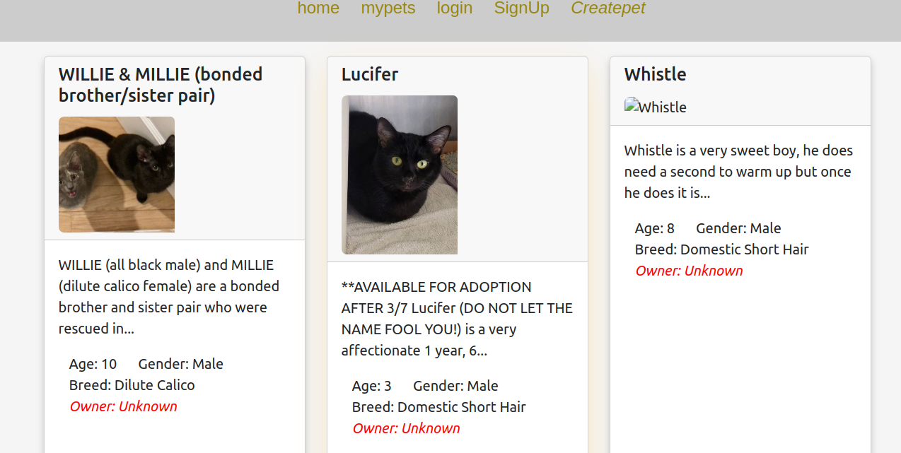
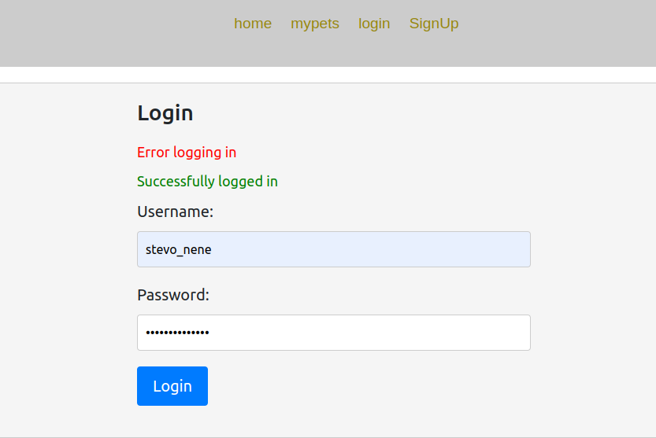
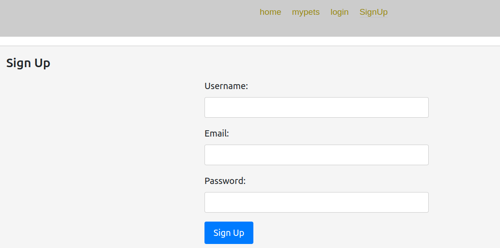

# PetFinder app React App

**live link:** [pefinder-webapp](https://frontpetfinder.netlify.app/)<br/>


## login and signup pages




## Backend Repository

[my-backend-repository](https://github.com/stephen-nene/petfinder-backend)


## Project Setup

- clone this repository by copying the code below to your terminal

```bash
git clone https://github.com/stephen-nene/petfinder-frontend
```
- cd into the directory with the cloned files

```bash
cd petfinder-frontend
```

- run bundle install to get all the gem dependencies installed
```
npm install
```
- To run the magazine-domain use rake tasks

```bash
npm start
```


## Owner

1. [Steve Nene](https://github.com/stephen-nene)

   ### Message from contributor
- I appreciate your interest in our project, and we hope that you find it helpful and informative. If you have any questions or feedback, please feel free to reach out to us. Thank you for choosing our Product Review project!


## License

- **NeneCorp** <span>&copy;</span>


